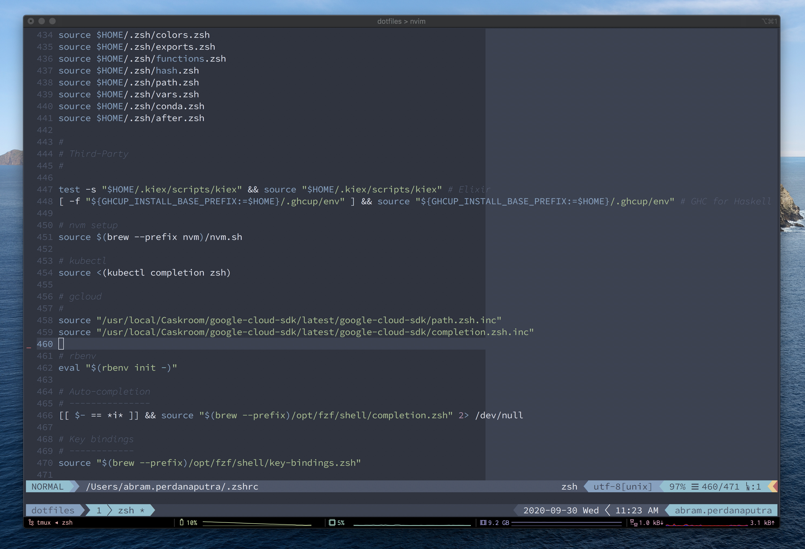

# dotfiles



* Target platforms: macOS
* Visible in the screenshot:
  * [nord](https://www.nordtheme.com) colorscheme.
  * [SauceCodePro Nerd Font](https://www.nerdfonts.com/font-downloads) (Regular) font.
  * Vim, running inside tmux, inside iTerm2, on macOS "Catalina".

## Features

To learn more about what's included, go here:
1. [zsh](https://github.com/abrampers/dotfiles/tree/master/zsh)
2. [vim](https://github.com/abrampers/dotfiles/tree/master/vim)
3. [tmux](https://github.com/abrampers/dotfiles/tree/master/tmux)

## Installation
### Clone
Clone repo to ~/.dotfiles
```sh-session
git clone --recursive https://github.com/abrampers/dotfiles
```

## Install
> ⚠️ **WARNING**: This install method will install every bit of my configuration. In the future, I'll be supporting customized install method.

This repo is using [Ansible](https://docs.ansible.com/ansible/latest/index.html) to automate installation. Please follow [Ansible installation guide](https://docs.ansible.com/ansible/latest/installation_guide/intro_installation.html#installing-ansible-on-macos) to install Ansible.

Then run ansible
```sh-session
ansible-playbook dotfiles.yml
```

## References
This setup is my modification of [Greg Hurell](https://github.com/wincent)'s dotfiles setup. Check it out [here](https://github.com/wincent/wincent)
