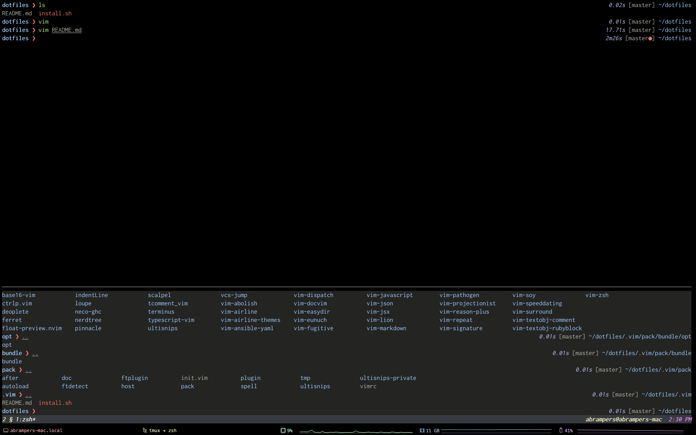
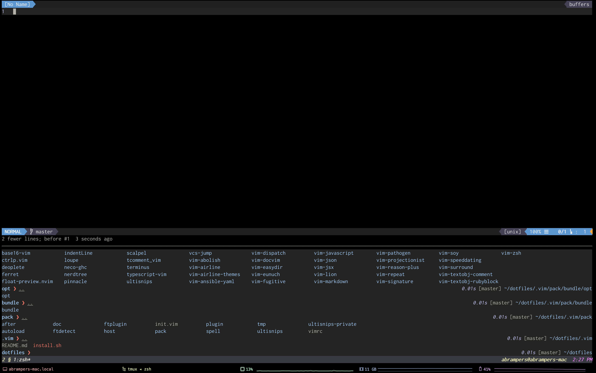

# My Terminal Cheatsheet

 

## What's included
### zsh
* autodotenv
* base16-shell
* color
* git-aliases
* plugin-osx
* zsh-autosuggestions
* zsh-history-substring-search
* zsh-syntax-highlighting

### Vim
Includes:
* NerdTree
* vim-airline
* vim-pathogen
* YouCompleteMe

For keybindings cheatsheet, go [here](vim-cheatsheet.md)

### tmux
With everything it includes. For keybindings cheatsheet, go [here](tmux-cheatsheet.md)

## Get Started
```sh-session
./install.sh
```

## Update Packages
```sh-session
git submodule update --remote --recursive
```

## References
This setup is my modification of [Greg Hurell](https://github.com/wincent)'s dotfiles setup. Check it out [here](https://github.com/wincent/wincent)
