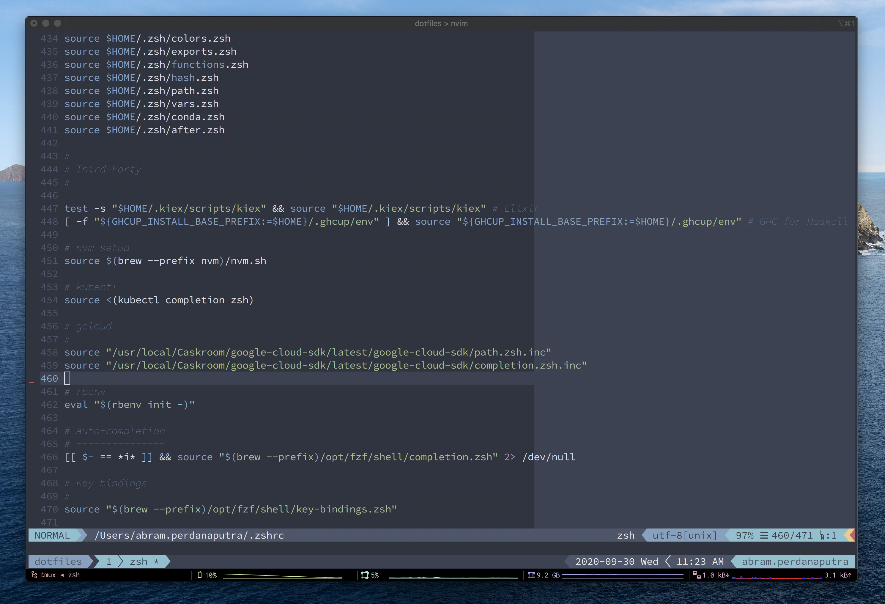
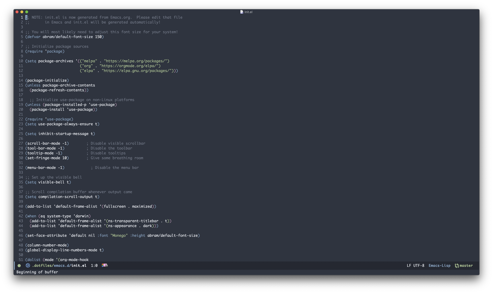

#+title: ~/.dotfiles

I am currently running [[https://www.apple.com/macos][macOS]].

Here's a few examples of my workspace.

#+caption: Terminal + neovim
#+attr_html: :width 800

- Visible in the screenshot:
  - [[https://www.nordtheme.com][nord]] colorscheme.
  - [[https://www.nerdfonts.com/font-downloads][SauceCodePro Nerd Font]] (Regular) font.
  - neovim, running inside tmux, inside iTerm2, on macOS 10.15 Catalina

#+caption: Emacs
#+attr_html: :width 800

- Visible in the screenshot:
  - [[https://www.nordtheme.com][nord]] colorscheme.
  - [[https://github.com/cseelus/monego][Monego]] (Regular) font.
  - Emacs

#+begin_quote
This whole repository isn't /really/ intended for anyone's use but my own, and
of course it's catered to my way of doing things, so, be prepared for
that.
#+end_quote

* Features

Since I'm using =evil-mode=, I configured vim and emacs to have the same keybindings when possible.

** [[zshrc][zsh]]

- [[https://github.com/junegunn/fzf][fzf]]: fuzzy finder to search for files, strings, or history
- =color=: change terminal and Vim color scheme
- =tmux=: terminal multiplexer to organize sessions
- =zsh-autosuggestions=: suggest previously entered commands
- =zsh-history-substring-search=: search previous command by substring
- =zsh-syntax-highlighting=: highlighting on zsh

and many more..

** [[vim/vimrc][vim]]

- [[https://github.com/neoclide/coc.nvim][coc.nvim]]: code completion engine + language server. easy plugin installation
- [[https://github.com/junegunn/fzf.vim][fzf.vim]]: fuzzy finder in vim
- [[https://github.com/preservim/nerdtree][nerdtree]]: tree representation for projects and folders
- [[https://github.com/tpope/vim-fugitive][vim-fugitive]]: git client on vim

and many more..

For cheatsheet, go to [[vim/README.md]].

** [[emacs.d/configuration.org][emacs]]

- [[https://github.com/emacs-evil/evil][evil-mode]]: vim emulation on emacs
- [[https://orgmode.org][org-mode]]: must have outliner + planner + life management tool
- [[https://magit.vc][magit]]: git client on emacs
- [[https://github.com/emacs-lsp/lsp-mode][lsp-mode]]: lsp support for emacs
- [[https://github.com/jojojames/dired-sidebar][dired-sidebar]]: dired on sidebar

and many more..

* Installation

** Clone

Clone repo to =~/.dotfiles=

#+begin_src shell

git clone --recursive https://github.com/abrampers/dotfiles

#+end_src

** Install

#+begin_quote
⚠️ *WARNING*: This install method will install every bit of my configuration. In the future, I'll be supporting customized install method.
#+end_quote

This repo uses [[https://docs.ansible.com/ansible/latest/index.html][Ansible]] to automate installation. Please follow [[https://docs.ansible.com/ansible/latest/installation_guide/intro_installation.html#installing-ansible-on-macos][Ansible installation guide]] to install Ansible.

*** Prerequisites

Install =ansible-core= for a minimal footprint.
#+begin_src shell

python3 -m pip install --user ansible-core

#+end_src

Install the =community.general= collection.

#+begin_src shell

ansible-galaxy collection install community.general

#+end_src

Provisioning now lives under =ansible/= and the main entry point is =ansible/local_machine.yml=. The =rcrc= configuration excludes the =ansible/= tree, so provisioning files are not deployed as dotfiles by =rcup=.

*** Provisioning your local machine

#+begin_src shell

ANSIBLE_CONFIG=ansible/ansible.cfg ansible-playbook ansible/local_machine.yml

#+end_src

This step will get all dependencies only. Dotfiles apply will be handled separately

*** Apply dotfiles

Use the dedicated playbook to run =chezmoi apply=.

#+begin_src shell

ANSIBLE_CONFIG=ansible/ansible.cfg ansible-playbook ansible/chezmoi_apply.yml

#+end_src

*** Advanced real apply from `ansible/local_machine.yml`

If you specifically want the main provisioning playbook to run the same real-apply path, you must opt in with both the dedicated tag and the explicit enablement variables:

#+begin_src shell

ANSIBLE_CONFIG=ansible/ansible.cfg ansible-playbook ansible/local_machine.yml --tags dotfiles,chezmoi_apply -e dotfiles_chezmoi_apply_enabled=true

#+end_src

That advanced route exists for parity with the dedicated playbook, but the dedicated =ansible/chezmoi_apply.yml= path is the normal documented cutover command.

*** Dry run

Review the full bootstrap before applying it.

#+begin_src shell

ANSIBLE_CONFIG=ansible/ansible.cfg ansible-playbook ansible/local_machine.yml --check --diff

#+end_src

For the `chezmoi` migration path, this is also where you review the saved baseline and the =chezmoi apply --dry-run --verbose= output. The real apply step remains opt-in and outside the default local-machine workflow for now.

*** Targeted role execution

Run just one role slice by tag when you only want to inspect or apply a subset.

#+begin_src shell

ANSIBLE_CONFIG=ansible/ansible.cfg ansible-playbook ansible/local_machine.yml --tags dotfiles

#+end_src

To find the available role tags, inspect [[ansible/local_machine.yml]].

* References
1. [[https://github.com/wincent/wincent][Greg Hurell's dotfiles setup]]
2. [[https://www.youtube.com/watch?v=74zOY-vgkyw&list=PLEoMzSkcN8oPH1au7H6B7bBJ4ZO7BXjSZ][System Crafters Emacs from scratch series]] + the [[https://github.com/daviwil/emacs-from-scratch][configuration files]]
